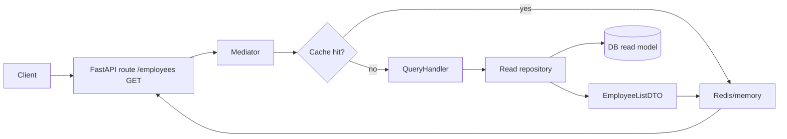

# Employee CRUD (CQRS + DDD) with FastAPI and Next.js

This project demonstrates a small CQRS/DDD implementation: FastAPI + SQLAlchemy on the backend, Next.js on the frontend, Redis (optional) for caching, and an outbox-driven projector to keep the read model up to date.

## Structure

- `backend/`: REST API built with FastAPI and SQLAlchemy.  
- `frontend/`: Next.js application that consumes the API to manage employees.  
- `docker-compose.yml`: Orchestration for running both services.

## Run with Docker

```bash
docker-compose up --build
````

* API available at `http://localhost:8000`
* Frontend available at `http://localhost:3000`

## Run Locally (optional)

### Backend

```bash
cd backend
python -m venv .venv
source .venv/bin/activate
pip install -r requirements.txt
uvicorn app.main:app --reload
```

### Frontend

```bash
cd frontend
npm install
npm run dev
```

The `NEXT_PUBLIC_API_URL` variable controls the API endpoint and defaults to `http://localhost:8000`.

---

## Arquitectura: CQRS + Mediator + Outbox

El backend no es CRUD monolítico tradicional: separa **commands** (escrituras) de **queries** (lecturas), usa un **mediator** para enrutar mensajes y un **read model** proyectado con outbox para que las lecturas sean ligeras y cacheables.

### Componentes principales (DDD-lite)
- **Dominio / Aggregate raíz**: `app.models.Employee` y sus invariantes se tocan en los handlers de commands.
- **Eventos de dominio**: `domain.events.employees` modela `EmployeeCreated/Updated/Deleted` y se publican en la outbox.
- **Command handlers**: `application/commands/...` mutan el modelo de escritura y registran eventos en la outbox.
- **Projectors (read side)**: `application/read_models/projectors/...` consumen eventos y actualizan la tabla `read_employees`.
- **DTOs de lectura**: `application/read_models/employees.py` define `EmployeeListDTO` (TypedDict) para exponer lecturas sin filtrar entidades.
- **Mediator**: `application/mediator/...` enruta comandos/queries y aplica behaviors (logging, cache, invalidación, dispatch de outbox).
- **Cache + invalidación**: `CacheBehavior` sirve lecturas desde Redis/memoria; `InvalidationService` limpia claves cuando hay writes.

### Flujo de escritura (Command)
```mermaid
flowchart LR
    Client --> API[FastAPI route /employees POST|PUT|DELETE]
    API --> Mediator
    Mediator --> CmdHandler[Command Handler]
    CmdHandler --> DB[(DB write model)]
    CmdHandler --> Outbox[(Outbox table)]
    Outbox -->|process| Projector
    Projector --> ReadDB[(DB read model)]
    CmdHandler --> Invalidator[Cache invalidation]
```

### Flujo de lectura (Query)


### Por qué DTO en lecturas
- Evita filtrar entidades SQLAlchemy, minimiza payload y facilita serialización/caching (dict plano).
- Permite evolucionar el read model (proyecciones, desnormalización) sin tocar el dominio de escritura.
- Encaja con CQRS: commands usan modelos de dominio; queries usan DTOs de lectura.

### Notas de DDD aplicadas
- **Ubiquitous Language**: conceptos Employee, Command, Query, Event, Projector, DTO.
- **Bounded Context**: un contexto simple de empleados; read model está desacoplado pero en el mismo contexto.
- **Eventos como contrato**: los projectors dependen solo de los eventos, no de los command handlers.
- **Infraestructura separada**: repositorios de lectura/escritura, cache, outbox y mediator viven en módulos independientes, permitiendo cambiar implementaciones.

### Capas relevantes
- `api/routes/...`: expone HTTP y transforma requests en commands/queries.
- `application/...`: casos de uso (command/query handlers), mediator y behaviors cross-cutting.
- `domain/...`: eventos y lógica de invalidación de cache asociada a comandos.
- `infrastructure/...`: persistencia (read/write repo), cache providers, outbox.
- `app/schemas.py`: contratos Pydantic para la API (entrada/salida).

### Ciclo de cache/invalidation
- Lecturas cacheadas con TTL corto (`application/read_models/ttl_config.py`).
- Commands disparan `CommandInvalidationBehavior` que borra claves afectadas (lista y detalle).
- Después de invalidar, `OutboxDispatchBehavior` procesa eventos y actualiza el read model; la siguiente lectura se recalienta en cache.
