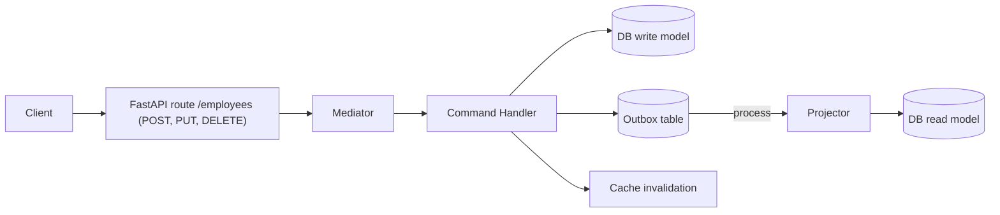
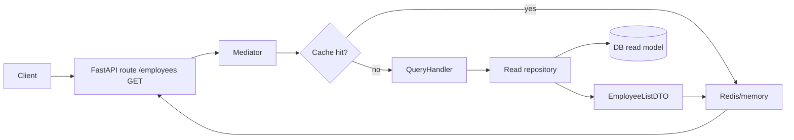

# Employee CRUD (CQRS + DDD) with FastAPI and Next.js

This project demonstrates a small CQRS/DDD implementation: FastAPI + SQLAlchemy on the backend, Next.js on the frontend, Redis (optional) for caching, and an outbox-driven projector to keep the read model up to date.

## Structure

- `backend/`: REST API built with FastAPI and SQLAlchemy.  
- `frontend/`: Next.js application that consumes the API to manage employees.  
- `docker-compose.yml`: Orchestration for running both services.

## Run with Docker

```bash
docker-compose up --build
````

* API available at `http://localhost:8000`
* Frontend available at `http://localhost:3000`

## Run Locally (optional)

### Backend

```bash
cd backend
python -m venv .venv
source .venv/bin/activate
pip install -r requirements.txt
uvicorn app.main:app --reload
```

### Frontend

```bash
cd frontend
npm install
npm run dev
```

The `NEXT_PUBLIC_API_URL` variable controls the API endpoint and defaults to `http://localhost:8000`.

---

## Architecture: CQRS + Mediator + Outbox

The backend is not a traditional monolithic CRUD: it separates **commands** (writes) from **queries** (reads), uses a **mediator** to route messages, and keeps a projected **read model** via outbox so reads stay lightweight and cache-friendly.

### Key components (DDD-lite)
- **Domain / Aggregate root**: `app.models.Employee`; invariants are enforced in command handlers.
- **Domain events**: `domain.events.employees` models `EmployeeCreated/Updated/Deleted` and pushes them to the outbox.
- **Command handlers**: `application/commands/...` mutate the write model and enqueue events.
- **Projectors (read side)**: `application/read_models/projectors/...` consume events and update the `read_employees` table.
- **Read DTOs**: `application/read_models/employees.py` defines `EmployeeListDTO` (TypedDict) to expose reads without leaking entities.
- **Mediator**: `application/mediator/...` routes commands/queries and applies behaviors (logging, cache, invalidation, outbox dispatch).
- **Cache + invalidation**: `CacheBehavior` serves reads from Redis/memory; `InvalidationService` removes keys when writes happen.

### Write flow (Command)


### Read flow (Query)


### Why DTOs on reads
- Avoid leaking SQLAlchemy entities; smaller payload, easier serialization/caching (plain dict).
- Let the read model evolve (projections, denormalization) without touching the write domain.
- Fits CQRS: commands use domain models; queries use read DTOs.

### DDD notes applied
- **Ubiquitous Language**: Employee, Command, Query, Event, Projector, DTO.
- **Bounded Context**: a simple employee context; the read model is decoupled but lives in the same context.
- **Events as contract**: projectors depend only on events, not on command handlers.
- **Separated infrastructure**: read/write repositories, cache, outbox, and mediator live in separate modules so implementations can change freely.

### Relevant layers
- `api/routes/...`: exposes HTTP and turns requests into commands/queries.
- `application/...`: use cases (command/query handlers), mediator, and cross-cutting behaviors.
- `domain/...`: events and cache invalidation logic tied to commands.
- `infrastructure/...`: persistence (read/write repos), cache providers, outbox.
- `app/schemas.py`: Pydantic contracts for API input/output.

### Cache/invalidations lifecycle
- Reads are cached with short TTLs (`application/read_models/ttl_config.py`).
- Commands trigger `CommandInvalidationBehavior` to delete affected keys (list and detail).
- After invalidation, `OutboxDispatchBehavior` processes events and updates the read model; the next read warms the cache again.
